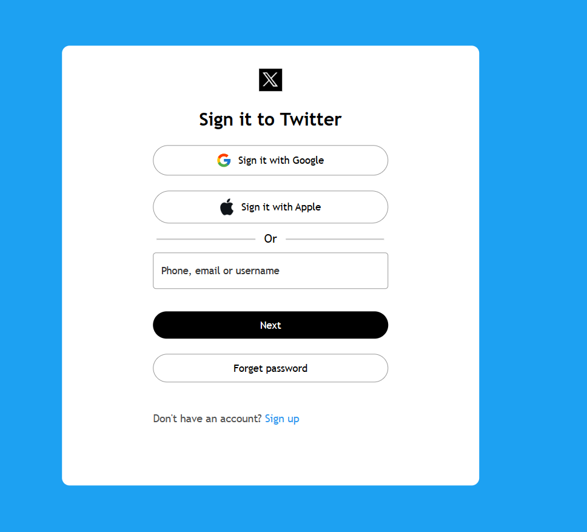

# Twitter-like Login Page

A simple login page resembling the Twitter login interface.

# Screenshot

# Description

This project is a basic HTML and CSS implementation of a login page that resembles the Twitter login interface. It includes form inputs for username/phone/email and password, along with buttons for various sign-in methods.
Features

    Sign in with Google and Apple options
    Standard username/phone/email input and "Next" button
    "Forgot password" option
    "Sign up" link to create a new account